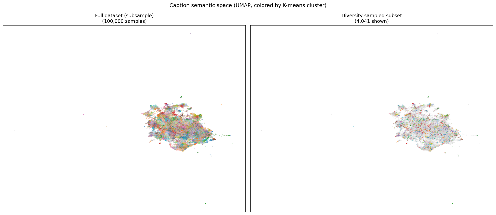
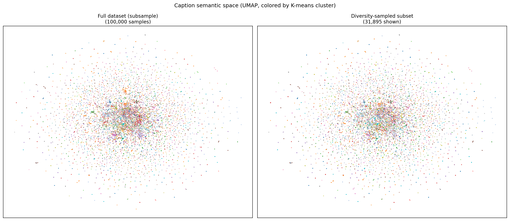
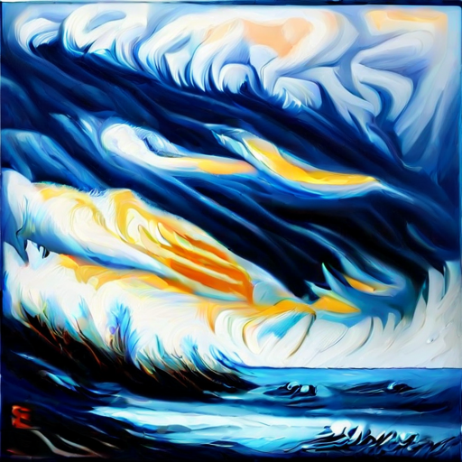
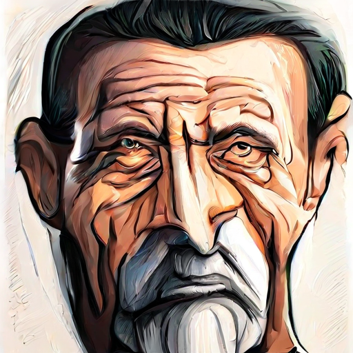

# HomeMadeDiffusion

A latent diffusion model built from scratch — Diffusion Transformer (DiT) with Flow Matching, trained on an RTX 3090. Text-conditional image generation at 512×512 using CLIP conditioning and SDXL-compatible latents.

---

## Architecture

| Component | Detail |
|-----------|--------|
| Backbone | DiT (Diffusion Transformer) |
| Conditioning | Hybrid AdaLN-Zero + Cross-Attention |
| Text encoder | CLIP ViT-L/14 (frozen) |
| VAE | SDXL-compatible (`madebyollin/sdxl-vae-fp16-fix`) |
| Depth / Hidden | 28 blocks / 1024 |
| Heads / Patch | 16 / 2 |
| Parameters | ~651M (DiT trunk) |
| Diffusion | Flow Matching (OT-CFM, Euler sampler) |
| Precision | bfloat16 mixed |

The text embedding is routed through a `ConditionManager` into two paths: a pooled global vector (AdaLN-Zero scale/shift/gate on every block) and the full token sequence (cross-attention sub-layer in every DiT block).

---

## Training Pipeline

Training ran in two phases, both on a single RTX 3090 (24 GB VRAM).

### Phase 1 — CC12M pre-training (~100k steps)
Pre-trained from scratch on CC12M (10.97M image-caption pairs).  
FID stabilised around 120–130; CLIP score ~0.21–0.22.

### Phase 2 — PickaPic fine-tune (~58k steps from CC12M checkpoint)
Fine-tuned on PickaPic v1 (583k human-preference image-caption pairs) continuing from the best CC12M checkpoint.  
Final metrics at step 50k: **FID = 85.62, CLIP = 22.50**.

---

## Dataset Curation

Raw CC12M contains 10.97M samples with highly skewed topic distribution. Before training, captions were embedded with a sentence-transformer (`all-MiniLM-L6-v2`), clustered into 500 mini-batch K-means clusters, and capped at 800 samples per cluster — producing a 392k diversity-balanced subset that preserves rare categories while trimming dominant ones.

The same procedure was applied to PickaPic (583k → diverse sub-selection for T5 caching, though training used the full set).

| Dataset | Before | After diversity sampling |
|---------|--------|--------------------------|
| CC12M | 10.97M | 392k |
| PickaPic | 583k | — (full set used) |

<table>
<tr>
  <td align="center"><br><sub>CC12M caption space — full vs diversity-sampled</sub></td>
  <td align="center"><br><sub>PickaPic caption space</sub></td>
</tr>
</table>

Each UMAP panel shows the semantic caption space before (left) and after (right) sampling, colored by K-means cluster. The right panel confirms broad coverage is maintained after trimming dominant clusters.

---

## Results

Evaluated at step 50k on 10 curated prompts × 4 images × 100 diffusion steps, guidance scale 6.5:

| Metric | Value |
|--------|-------|
| FID (PickaPic val) | 85.62 |
| CLIP score | 22.50 |
| Portfolio-quality CLIP (≥0.27) | 6/10 prompt categories |

**CLIP score by prompt (step 50k, 4-image mean):**

| Prompt | Mean CLIP |
|--------|-----------|
| Cinematic astronaut on salt flat | 0.276 |
| Oil painting of stormy sea | 0.288 |
| Cobblestone street, European town | 0.248 |
| Sunflower field under blue sky | 0.253 |
| Sandy beach with turquoise water | 0.252 |
| Golden retriever sitting on grass | 0.262 |
| Mountain lake at sunset | 0.232 |
| Cherry blossom tree in full bloom | 0.229 |
| Astronaut in white spacesuit | 0.260 |
| Tall green cactus in sandy desert | 0.245 |

Scores below 0.22 (ramen, pencil sketch portrait) reflect CLIP's attribute-binding ceiling rather than training failure — the 77-token mean-pooled representation cannot bind fine-grained spatial/material constraints. Fixing these prompts requires a T5-XL upgrade (see Future Work).

---

## Gallery

All images generated with 100 DDIM steps, guidance scale 6.5, from the step-50k checkpoint.

<table>
<tr>
  <td align="center"><br><sub>"An astronaut in a white spacesuit walking on a salt flat"</sub></td>
  <td align="center"><br><sub>"An oil painting of a stormy sea with dramatic waves"</sub></td>
  <td align="center"><br><sub>"A cherry blossom tree in full bloom"</sub></td>
  <td align="center"><br><sub>"A golden retriever dog sitting on grass"</sub></td>
</tr>
<tr>
  <td align="center"><br><sub>"A narrow cobblestone street in an old European town"</sub></td>
  <td align="center"><br><sub>"A mountain lake reflecting the surrounding peaks at sunset"</sub></td>
  <td align="center"><br><sub>"A cozy living room with a fireplace and bookshelves"</sub></td>
  <td align="center"><br><sub>"A pencil sketch portrait of an elderly man with wrinkles"</sub></td>
</tr>
</table>

---

## Reproducing

```bash
# Install dependencies
uv sync

# Generate images from a checkpoint
python scripts/portfolio_eval.py \
    --checkpoints "/path/to/dit_step0050000.pt" \
    --config configs/train_pickapic_cc12m_continued.yaml \
    --out-dir outputs/ \
    --num-images 4 \
    --num-steps 100 \
    --guidance-scale 6.5

# Run the test suite
pytest tests/ -v
```

---

## Future Work

**T5-XL encoder upgrade** — The complete implementation plan exists, all data preparation is done, and the architecture decisions are finalised. Deferred after the portfolio evaluation showed step-50k is already portfolio-ready for the targeted prompt categories.

Key planned changes:
- Replace CLIP ViT-L/14 with `google/t5-v1_1-xl` as the text encoder (`cond_dim: 768 → 2048`)
- Pre-cache T5 sequence embeddings for 583k PickaPic + 392k CC12M samples (~500 GB)
- Mixed training: 60% PickaPic + 40% diversity-sampled CC12M via `ConcatDataset`
- Resume from step-50k checkpoint with projectors re-initialised (transformer trunk kept frozen for warm-up)
- Expected improvement: attribute binding on complex multi-element prompts (ramen bowl, pencil sketch portrait) where CLIP's 77-token pooled representation fails
